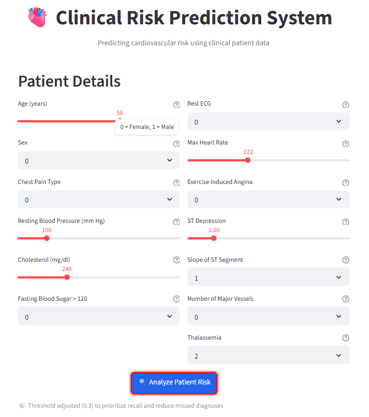
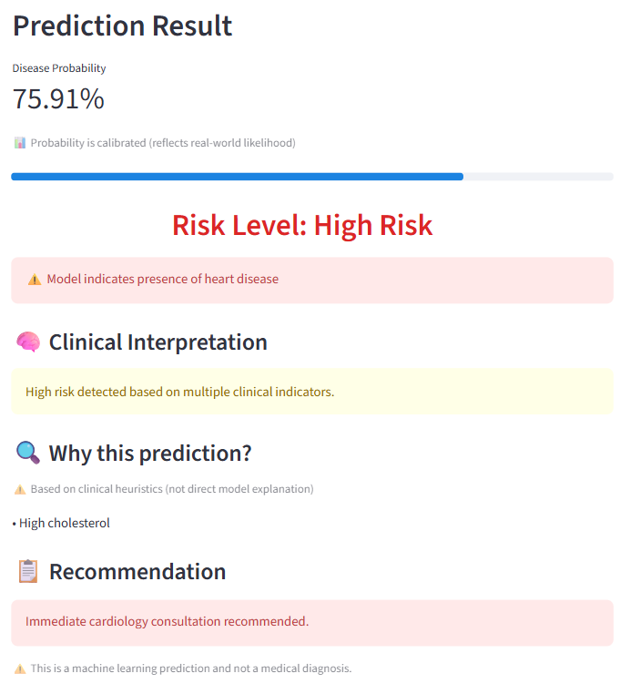
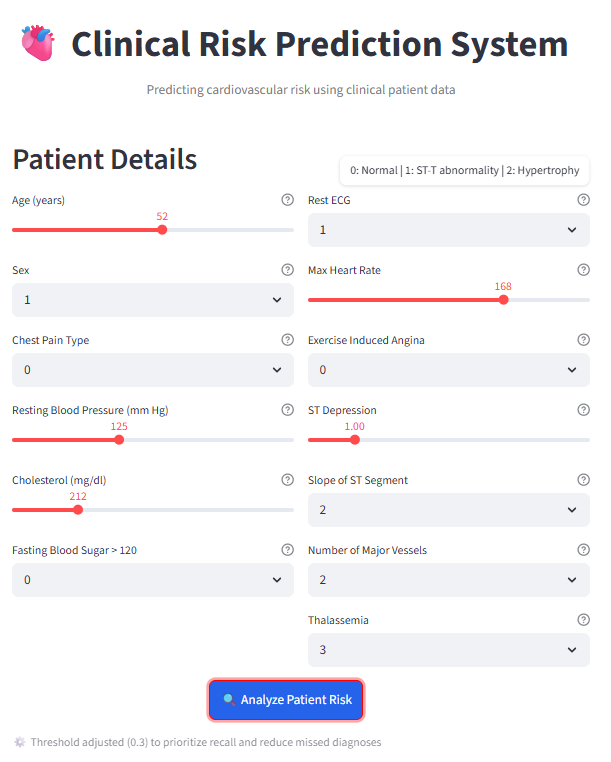
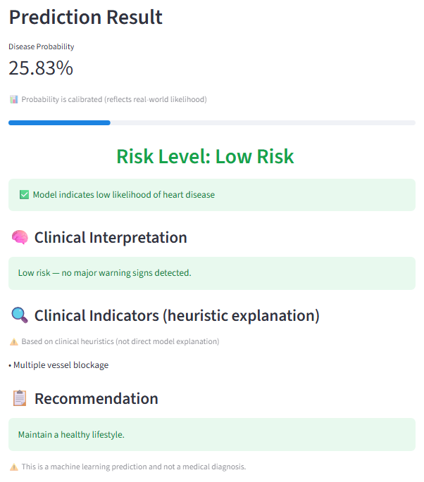

# 🫀 Clinical Risk Prediction System

Developed as a Bioengineering + Machine Learning project focused on clinically reliable prediction systems.

A machine learning-based **clinical decision support system** for predicting cardiovascular disease risk using patient clinical data.

This system demonstrates how ML can assist clinicians by prioritizing high-risk patients and reducing missed diagnoses.

---

## 🌐 Live Demo

👉 https://clinical-risk-predictor.streamlit.app

---

## 🚨 Problem Statement

Early detection of heart disease is critical.
In clinical settings, **missing a positive case (false negative)** can lead to severe consequences.

This project focuses on:

* **Maximizing recall** (reducing missed diagnoses)
* Providing **reliable probability estimates** for decision-making.

---

## 🧠 Approach

Dataset: UCI Heart Disease dataset (clinical tabular data).

* Model: **Calibrated Logistic Regression**
* Threshold tuning: **0.3 (recall-focused decision boundary)**
* Calibration: Ensures predicted probabilities reflect real-world likelihood
* Evaluation:

  * ROC-AUC
  * Precision-Recall Curve
  * Confusion Matrix
  * Cross-validation

---

## ⚖️ Key Design Decisions

### 1. Logistic Regression over Random Forest

Although Random Forest achieved near-perfect performance, it showed signs of **overfitting** due to dataset size.

Logistic Regression was chosen because:

* Better **generalization**
* **Interpretability** (important in healthcare)
* Supports **calibrated probabilities**

---

### 2. Threshold = 0.3 (instead of default 0.5)

* Improves **recall**
* Reduces **false negatives**
* Aligns with clinical priority of **early detection**

---

### 3. Calibration

Used `CalibratedClassifierCV` to ensure:

* Probability outputs are **trustworthy**
* Model can support **risk-based decision making**

---

## 📊 Results

* High recall for disease class (prioritized over precision to reduce missed diagnoses)
* Well-calibrated probabilities suitable for clinical decision-making
* Model Performance Comparison

Logistic Regression:
- ROC-AUC: 0.93
- Recall (Disease Class): 0.91
- Precision (Disease Class): 0.76
- F1-score: 0.83

Random Forest:
- ROC-AUC: 0.999
- Recall (Disease Class): 1.00
- Precision (Disease Class): 0.98
- F1-score: 0.99

Although Random Forest achieves near-perfect performance, this is likely due to overfitting given the small dataset size.

Logistic Regression was selected as the final model due to better generalization, interpretability, and more reliable calibrated probabilities, making it more suitable for clinical use.

Threshold tuning (0.3) was applied to further improve recall and align with clinical priorities.

---

## 💡 Features

* Risk stratification:

  * Low Risk (< 0.3)
  * Medium Risk (0.3 – 0.6)
  * High Risk (> 0.6)
* Human-readable clinical reasoning (heuristic-based explanations)
* Recommendation system based on risk level
* Deployed interactive Streamlit web application (public access)

---

## 🖥️ Demo

### High Risk Prediction




### Low Risk Prediction




---

## ⚠️ Limitations

* Dataset is relatively small
* Categorical variables treated as ordinal; proper encoding (e.g., OneHotEncoder) can improve performance.
* No external clinical validation

---

## 🔮 Future Improvements

* SHAP-based explainability
* Proper categorical encoding (OneHotEncoder)
* Validation on real-world clinical datasets

---

## 🛠️ Tech Stack

* Python
* scikit-learn
* pandas, numpy
* matplotlib, seaborn
* Streamlit (for deployment)
* joblib (model serialization)

---

## 📁 Project Structure

- app.py → Streamlit web app  
- notebook.ipynb → model development & analysis  
- model.pkl → trained model  
- columns.pkl → feature order used for prediction  
- requirements.txt → dependencies

---

## 🚀 How to Run

1. Clone the repository:
```bash
git clone https://github.com/TarunaJ2006/Clinical-Risk-Prediction-System.git
cd Clinical-Risk-Prediction-System
```

2. Install dependencies:
```bash
pip install -r requirements.txt
```

3. Run the app:
```bash
streamlit run app.py
```
---

## ⚠️ Disclaimer

This project is for educational purposes and is **not a substitute for medical diagnosis**.
